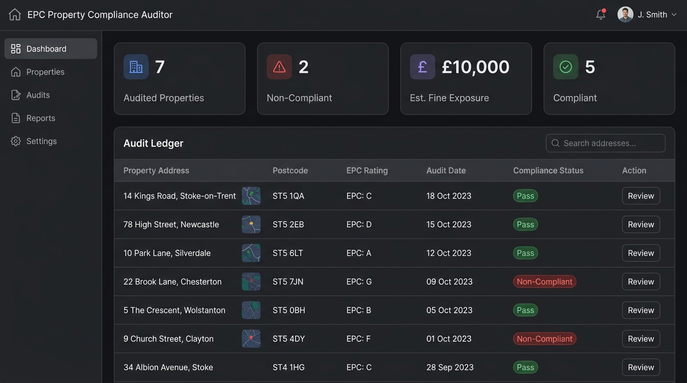

# UK Property EPC Compliance Tracker

An automated compliance dashboard designed for private landlords, property letting agents, and UK housing managers to scan property portfolios for Energy Performance Certificate (EPC) ratings, identify non-compliant properties, and project potential fine liabilities.



---

## 🏛️ Business Case & Compliance Context

Under the UK Government's **Minimum Energy Efficiency Standards (MEES)**, it is **unlawful** to let out a domestic property with an EPC rating of **F or G** (unless an official exemption is registered). 

* **The Risk:** Landlords and local councils face financial penalties of **up to £5,000 per property** for failing to comply with MEES regulations.
* **The Solution:** This tracker automates property audits by matching address spreadsheets against the official UK Government EPC database, surfacing compliance risks before they lead to inspections or fines.

---

## 🛠️ Technology Stack

* **Backend Proxy:** Node.js (ES Modules) & Express
* **Frontend UI:** HTML5, CSS3 (Custom HSL Grid system), Vanilla JavaScript
* **Compliance Data:** Live integrations with the **MHCLG Open Data Communities EPC API**
* **Database:** No heavy setup required (local session storage & SQLite ready)

---

## 🚀 Quick Start (Local Setup)

### 1. Register for free EPC API Credentials
1. Go to the [UK Government Open Data EPC Register](https://opendatacommunities.org/pc/register).
2. Input your email address to receive your free API token.

### 2. Configure Environment
Create a `.env` file in the root directory:
```bash
cp .env.example .env
```
Open `.env` and fill in your registered email and key:
```env
PORT=3000
EPC_API_EMAIL=your-registered-email@example.com
EPC_API_KEY=your-api-token-received
```

### 3. Install & Launch
Install dependencies:
```bash
npm install
```
Start the local server:
```bash
npm start
```
Open **[http://localhost:3000](http://localhost:3000)** in your browser.

---

## 📊 CSV Upload Format

To audit a portfolio in bulk, upload a `.csv` file containing the following column header:
```csv
address,postcode
"Flat 1, 10 High Street","ST5 1QA"
"24 London Road","ST4 1BU"
```
The tracker will automatically geocode/query each address, fetch its live EPC certificate, and generate your compliance summary dashboard.
