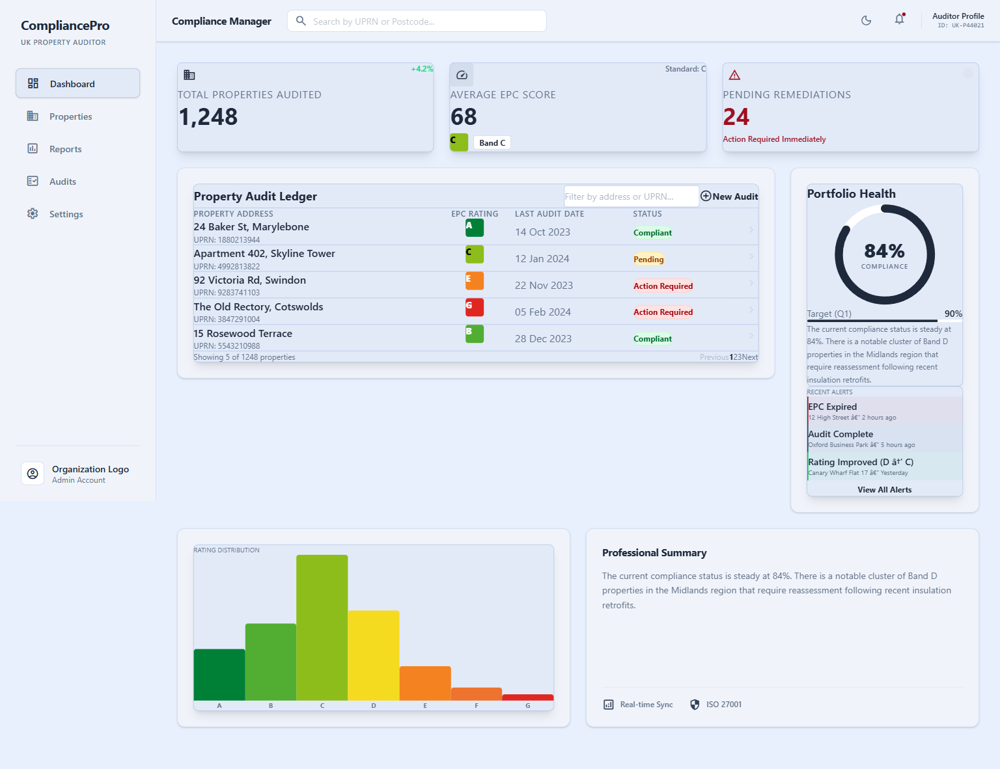
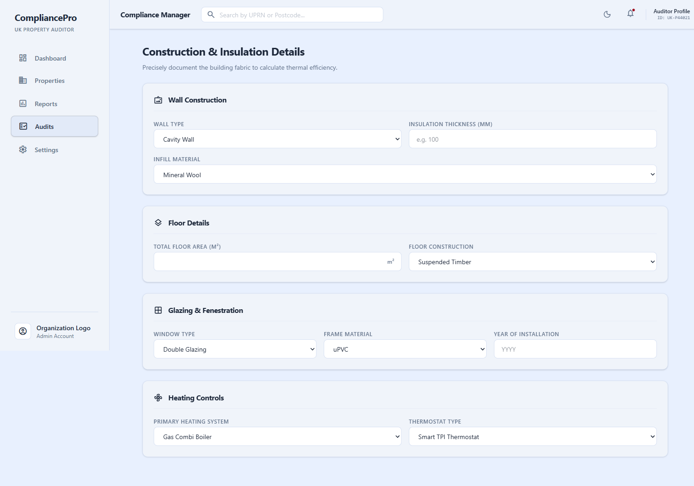
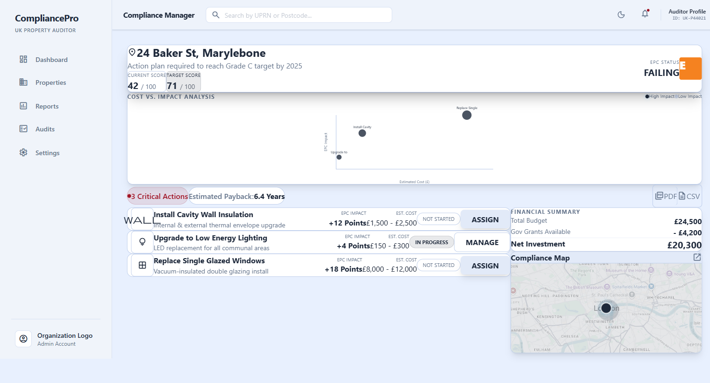

# UK EPC Compliance Tracker

A personal educational portfolio project exploring how a property energy-data workflow could be represented as a modern React dashboard.

> [!WARNING]
> **Personal portfolio project - not an official EPC or compliance service.**
> This repository is for software engineering practice and interface demonstration. It is not affiliated with or endorsed by the UK Government, an EPC assessment body, or a regulatory authority. The repository currently uses deterministic mock portfolio data and heuristic estimates. It must not be used to produce an EPC, SAP/RdSAP assessment, MEES advice, legal advice, financial advice, or an official compliance decision.

## What This Demonstrates

- React 19 and TypeScript single-page application structure
- Vite build tooling with Tailwind CSS v4 theme tokens
- Reusable dashboard, audit workspace, and remediation components
- Responsive light and dark themes driven by CSS variables
- FastAPI endpoints with Pydantic request and response models
- Pure Python heuristic calculation functions with pytest coverage
- Vercel static frontend deployment with Python API routing
- Safe local environment configuration using `.env.example`

## Current Data Behaviour

The current application is a portfolio demonstration. Dashboard, audit ledger, alerts, and remediation views are populated with deterministic mock data from the FastAPI layer. The Live Audit view sends form data to a local heuristic endpoint and displays an estimate for interface testing.

These values are not official EPC or SAP calculations. No government certificate is issued, no compliance decision is made, and no private landlord or tenant data is included.

## Screenshots

### Dashboard



### Interface Themes (Dark & Light Mode)

 

### Live Audit Workspace



### Remediation Action Plan



## Architecture

```text
React/Vite frontend
        |
        | HTTP requests to /api/*
        v
FastAPI Python function at api/index.py
        |
        +-- Pydantic models in api/models.py
        +-- Heuristic calculations in api/calculations.py
        +-- Pytest coverage in api/test_calculations.py
```

### Frontend

- `src/pages/` contains the Dashboard, Live Audit, and Remediation routes.
- `src/components/` contains reusable layout, form, chart, ledger, and action-plan components.
- `src/api/client.ts` centralises calls to the local or deployed API base URL.
- `src/index.css` registers the light and dark Compliance Core token system for Tailwind v4.

### API

The FastAPI application is located at `api/index.py` and exposes:

- `GET /api/portfolio/summary`
- `GET /api/audits?page=1`
- `GET /api/alerts`
- `GET /api/remediation/{uprn}`
- `POST /api/audits/estimate`
- `POST /api/audits`
- `POST /api/remediation/{action_id}/assign`

## Local Setup

### 1. Install frontend dependencies

From the repository root:

```powershell
npm install
copy .env.example .env
```

The local frontend expects the API at `http://127.0.0.1:8000`.

### 2. Install API dependencies

```powershell
cd api
python -m venv .venv
.\.venv\Scripts\Activate.ps1
pip install -r requirements.txt
```

### 3. Run the API

From the `api` directory:

```powershell
uvicorn index:app --reload --port 8000
```

### 4. Run the frontend

Open a second terminal at the repository root:

```powershell
npm run dev
```

Open the local Vite URL shown in the terminal, normally `http://localhost:5173`.

## Verification

```powershell
npm run lint
npm run build
```

Run the Python tests from the `api` directory:

```powershell
pytest
```

## Vercel Configuration

`vercel.json` defines two build paths:

- `@vercel/static-build` builds the Vite frontend into `dist/`.
- `@vercel/python` serves `api/index.py` as the Python API function.
- `/api/*` requests are routed to the FastAPI function.
- Other routes are served by the React application.

Environment files are intentionally excluded from Git. Use `.env.example` as the safe configuration reference and never commit API keys or private data.

## Project Status

This is an evolving personal portfolio project. The current focus is improving the local API contract, testing the heuristic calculation boundaries, and keeping the frontend presentation technically honest and visually polished.

## License

MIT. See [LICENSE](LICENSE).