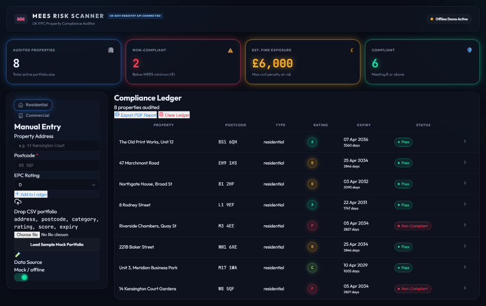

# UK Property EPC Compliance Auditor

An automated compliance dashboard designed for private landlords, property letting agents, and UK housing managers to scan property portfolios for Energy Performance Certificate (EPC) ratings, identify non-compliant properties, and project potential fine liabilities.



---

## 🏛️ Business Case & Compliance Context

Under the UK Government's **Minimum Energy Efficiency Standards (MEES)**, it is **unlawful** to let out a domestic property with an EPC rating of **F or G** (unless an official exemption is registered). 

* **The Risk:** Landlords and local councils face financial penalties of **up to £5,000 per residential property and up to £150,000 per commercial property** for failing to comply with MEES regulations.
* **The Solution:** This tracker automates property audits by matching address spreadsheets against the official UK Government EPC database, surfacing compliance risks before they lead to inspections or fines.

---

## 🛠️ Technology Stack

* **Backend Proxy:** Node.js (ES Modules) & Express
* **Frontend UI:** HTML5, CSS3 (Custom HSL Grid system), Vanilla JavaScript
* **Compliance Data:** Live integrations with the new UK government **EPB Developer API**
* **Database:** No heavy setup required (local session storage & SQLite ready)

---

## 🚀 Quick Start (Local Setup)

### 1. Register for free EPC API Credentials
1. Go to the [UK Government Get Energy Performance of Buildings Data Portal](https://get-energy-performance-data.communities.gov.uk/).
2. Log in with your GOV.UK One Login credentials.
3. Create your developer account to retrieve your **Bearer Token** under "My Account".

### 2. Configure Environment
Create a `.env` file in the root directory:
```env
PORT=3000
EPC_API_KEY=your-api-bearer-token-here
```

### 3. Install & Launch
Install dependencies:
```bash
npm install
```
Start the local server:
```bash
npm start
```
Open **[http://localhost:3000](http://localhost:3000)** in your browser.

---

## 🧠 Challenges Faced & Solved

Building this auditor required overcoming several real-world data engineering challenges:

### 1. The UK Government Database Migration (May 30, 2026)
* **Problem:** Mid-development, the UK government retired the legacy `epc.opendatacommunities.org` database domain and its legacy Basic Auth system (using `email:key`). The old URL was set to redirect queries to the login homepage, returning HTML instead of JSON and breaking all existing code.
* **Solution:** We traced the undocumented API updates through the new beta service guidelines. We migrated the integration to the new subdomain (`api.get-energy-performance-data.communities.gov.uk`), switched the header authentication schema to a modern **Bearer Token** protocol, and mapped our parsers to the government's updated JSON schema.

### 2. Substring Address Matching Bug
* **Problem:** If a landlord scanned flat number `9`, a simple text search like `.includes('9')` would match flat `19`, `29`, or blocks labeled `9 to 17`. This resulted in incorrect certificates being matched to properties.
* **Solution:** We implemented strict regex word-boundary matching rules:
  1. Starts with house number (e.g., `^9\b` or `^9,`).
  2. Starts with standard flat/apartment descriptors followed by the number (e.g., `Flat 9`, `Apartment 9`).
  This ensures flat 9 never gets false-matched with block ranges or higher numbers.

### 3. Postcode Sweeping & Expansion
* **Problem:** Letting agents often want to audit an entire street or residential block without entering every house number manually.
* **Solution:** We added a "Postcode Sweep" feature. If a user leaves the address field blank and submits a postcode, the server detects this and expands the single postcode query into a full-scale sweep, returning **every single registered domestic property** in that postcode area.

---

## 🔒 Production Security & Data Protection

If this application is deployed in a commercial environment, protecting property data and preventing unauthorized bulk scraping of addresses is critical:

### 1. User Authentication Portal (Auth Gate)
* **Action:** Gate the web panel behind a secure authentication system (such as **Clerk** or **Firebase Auth**). 
* **Reason:** This ensures only authorized lettings administrators or portfolio owners can input property addresses and view compliance records.

### 2. Rate Limiting on Backend Proxy
* **Action:** Implement rate-limiting middleware (such as `express-rate-limit`) on the `/api/check` endpoint.
* **Reason:** This prevents malicious actors from automating address lookups or attempting to scrape the government database through your server proxy.

### 3. Masking & Minimization
* **Action:** Restrict the return payload to only what is required for MEES audits. UPRNs (Unique Property Reference Numbers) and certificate numbers can be masked on client screens, displaying only compliance ratings and fine risks to non-administrators.

---

## 📊 CSV Upload Format

To audit a portfolio in bulk, upload a `.csv` file containing the following column headers:
```csv
address,postcode
"Flat 1, 10 High Street","ST5 1QA"
"24 London Road","ST4 1BU"
```
The tracker will automatically geocode/query each address, fetch its live EPC certificate, and generate your compliance summary dashboard.
